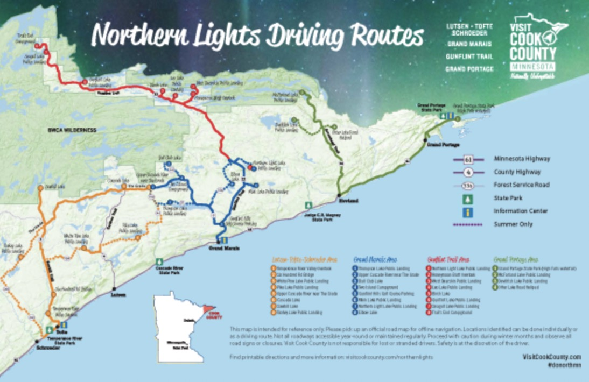

# Project Proposal: Northern Light and Stars Chasing Guidance Shiny App

## **Introduction:**

The Northern Light and Stars Chasing Guidance Shiny App is a web-based application that helps users plan their trip to Cook County, Minnesota, to see the Northern Lights and other celestial events. The app provides users with two interactive maps: a map that shows the best spots to view the Northern Lights and a map that shows the location of numerous celestial objects like stars, constellations, and the Milky Way. In addition, the app includes nearby hotels with operating hours and contact information, and restaurants where they can enjoy a meal. It also displays the 27-day, 3-day, and 30-minute aurora forecast captured from the NOAA website and an up to date forecast of planet visibility based on time of day. 

(s**ample picture from [visitcookcounty](https://www.visitcookcounty.com/outdoors/northern-lights/).com)**

### **Team Members:** Yansong Wen, Ashley Farnum

### **Product Title:** Northern Light and Star Chasing Guidance

### **Product Type:** Shiny app

## **Product Purpose:**

The main purpose of our app is to create a user-friendly website that makes it easier for users to plan their trip to Cook County, Minnesota for Northern Light and star chasing. Cook County is the best place in the state of Minnesota to view the Northern Lights and the Northern Light and Star Chasing Guidance app will provide users with all the necessary information they need including the best spots to view the Northern Lights, planetary and star visibility based off their approximate location, hotels, and restaurants in the area, as well as the aurora forecast.

## **Data Sources:**

We will be using publicly available data sources for our app, including geographic features and stored information from Google Maps and aurora forecasts from NOAA. The star and planetary data is from The Stellarium Web online planetarium that runs off open source data from the Stellarium Web Engine Project. 

## **Product Features:**

The main elements of our data product include an interactive map showing the spots to gaze at the Northern Lights and an interactive map that displays planetary and star locations, hotels to rest, and restaurants to have a meal in Cook County. We will also include plots showing the KP level in 27 days, the planetary visibility forecast, and a table showing the local weather for the upcoming week. These features will provide users with the necessary information they need to plan their trip and enjoy viewing the Northern Lights and celestial night sky.

## **Automation:**

We plan to extract data from the source websites like Google Maps, NOAA, and The Stellarium Web website. Updating of source sites will trigger updates on the app.

## **Interactivity:**

The app will allow users to check the information of landmarks on the map by clicking and moving the cursor. They will also be able to check the information of aurora forecast, night stars, and weather by choosing from the interaction tab and entering their approximate location.

## **Programming Challenges:**

The main programming challenges we anticipate facing include extracting data from the NOAA, star, and weather forecast websites and combining that information into the main map. An additional challenge involves interactivity with another webpage by inputting information into the shiny app.

## **Division of Labor:**

Ashley will take charge of the inner function of the star map, and Yansong will take charge of the Aurora map. They will work together on the geographic features, the UI, and the server.

In conclusion, the Northern Light and Stars Chasing Guidance Shiny App is a user-friendly website that makes it easier for users to plan their trip to Cook County to view the Northern Lights and local celestial night sky. With interactive maps, plots, and other features, users will have all the necessary information they need to have a fantastic experience exploring the night sky.

## **Reference links:**

1.  The stellarium web page: <https://stellarium-web.org/p/observations>
2.  The stellarium project: <https://github.com/Stellarium/stellarium-web-engine>
3.  NOAA website: <https://www.noaa.gov/>
4.  Aurora forecast extract sample: <https://github.com/calabresemic/aurora-api/blob/main/auroranoaa/__init__.py>
5.  Weather data (api) : <https://www.visualcrossing.com/weather-api?ga_api10=&gclid=CjwKCAjw5pShBhB_EiwAvmnNV8djkVg-Bik7ToFYP-aolivnTTMLBJRIV47OoiWW8Ris0yBlKG8eHRoCIB0QAvD_BwE>
